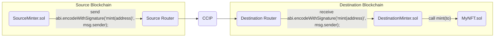

## CCIP Starter Kit

> **Note**
>
> _This repository represents an example of using a Chainlink product or service. It is provided to help you understand how to interact with Chainlink’s systems so that you can integrate them into your own. This template is provided "AS IS" without warranties of any kind, has not been audited, and may be missing key checks or error handling to make the usage of the product more clear. Take everything in this repository as an example and not something to be copy pasted into a production ready service._

This project demonstrates a couple of basic Chainlink CCIP use cases.

## Prerequisites

- [Git](https://git-scm.com/book/en/v2/Getting-Started-Installing-Git)
- [Current LTS Node.js version](https://nodejs.org/en/about/releases/)

Verify installation by typing:

```shell
node -v
```

and

```shell
npm -v
```

## Getting Started

1. Install packages

```
npm install
```

2. Compile contracts

```
npm run compile
```

## What is Chainlink CCIP?

**Chainlink Cross-Chain Interoperability Protocol (CCIP)** provides a single, simple, and elegant interface through which dApps and web3 entrepreneurs can securely meet all their cross-chain needs, including token transfers and arbitrary messaging.


With Chainlink CCIP, one can:

- Transfer supported tokens
- Send messages (any data)
- Send messages and tokens

CCIP receiver can be:

- Smart contract that implements `CCIPReceiver.sol`
- EOA

**Note**: If you send a message and token(s) to EOA, only tokens will arrive

To use this project, you can consider CCIP as a "black-box" component and be aware of the Router contract only. If you want to dive deep into it, check the [Official Chainlink Documentation](https://docs.chain.link/ccip).

## Usage

In the next section you can see a couple of basic Chainlink CCIP use case examples. But before that, you need to set up some environment variables.

We are going to use the [`@chainlink/env-enc`](https://www.npmjs.com/package/@chainlink/env-enc) package for extra security. It encrypts sensitive data instead of storing them as plain text in the `.env` file, by creating a new, `.env.enc` file. Although it's not recommended to push this file online, if that accidentally happens your secrets will still be encrypted.

1. Set a password for encrypting and decrypting the environment variable file. You can change it later by typing the same command.

```shell
npx env-enc set-pw
```

2. Now set the following environment variables: `PRIVATE_KEY`, Source Blockchain RPC URL, Destination Blockchain RPC URL. You can see available options in the `.env.example` file or check out the [latest supported networks in the docs](https://docs.chain.link/ccip/supported-networks):

```shell
ETHEREUM_SEPOLIA_RPC_URL=""
OPTIMISM_SEPOLIA_RPC_URL=""
ARBITRUM_SEPOLIA_RPC_URL=""
AVALANCHE_FUJI_RPC_URL=""
POLYGON_AMOY_RPC_URL=""
BNB_CHAIN_TESTNET_RPC_URL=""
BASE_SEPOLIA_RPC_URL=""
KROMA_SEPOLIA_RPC_URL=""
WEMIX_TESTNET_RPC_URL=""
GNOSIS_CHIADO_RPC_URL=""
CELO_ALFAJORES_RPC_URL=""
METIS_SEPOLIA_RPC_URL=""
ZKSYNC_SEPOLIA_RPC_URL=""
```

To set these variables, type the following command and follow the instructions in the terminal:

```shell
npx env-enc set
```

After you are done, the `.env.enc` file will be automatically generated.

If you want to validate your inputs you can always run the next command:

```shell
npx env-enc view
```

### Test

There are two types of tests in this project:

- **./test/no-fork/**: These tests run on your local hardhat node and do not require forking.
- **./test/fork/**: These tests run on a forked mainnet network and require forking the source and destination blockchains.

#### No Fork

To run the tests that do not require forking, type:

```shell
npm run test:no-fork
```

#### Fork

The tests are forking _Arbitrum Sepolia_ as source chain and _Ethereum Sepolia_ as destination chain. Before you begin, make sure to set up the rpc urls in your `.env.enc` file.

To run the tests that require forking, type:

```shell
npm run test:fork
```

### Faucet

You will need test tokens for some of the examples in this Starter Kit. Public faucets sometimes limit how many tokens a user can create and token pools might not have enough liquidity. To resolve these issues, CCIP supports two ERC20 tokens (`CCIP-BnM` and `CCIP-LnM`) that you can mint permissionlessly on each supported testnet so you don't run out of tokens while testing different scenarios. You can get the addresses for the test tokens, for each supported network, [here](https://docs.chain.link/ccip/supported-networks). You can understand the architecture principles behind these two test tokens [here](https://docs.chain.link/ccip/architecture#token-pools).

To get 10\*\*18 units of each of these tokens, use the `faucet` task. Keep in mind that the `CCIP-BnM` test token you can mint on all testnets, while `CCIP-LnM` you can mint only on Ethereum Sepolia. On other testnets, the `CCIP-LnM` token representation is a wrapped/synthetic asset called `clCCIP-LnM`.

```shell
npx hardhat faucet
--receiver <RECEIVER_ADDRESS>
--ccip-bnm <CCIP_BnM_ADDRESS> # Optional
--ccip-lnm <CCIP_LnM_ADDRESS> # Optional
```

For example, to mint tokens on ethereumSepolia run:

```shell
npx hardhat faucet --network ethereumSepolia --receiver <RECEIVER_ADDRESS>
```

### Example 1 - Transfer CCIP Test Tokens from EOA to EOA

To transfer tokens from one EOA on one blockchain to another EOA on another blockchain you can use the `ccip-token-transfer` command:

```shell
npx hardhat ccip-token-transfer
--source-blockchain <sourceBlockchain>
--destination-blockchain <destinationBlockchain>
--receiver <receiverAddressOnDestinationBlockchain>
--token-address <tokenToSendAddressOnSourceBlockchain>
--amount <amountToSend>     # in units (eg wei)
--fee-token-address  <feeTokenAddress> # Optional
--router <sourceChainRouterAddress> # Optional
--gasLimit <gasLimit> # Optional
```

Where the list of supported chains consists of (case sensitive):

- ethereumSepolia
- polygonAmoy
- optimismSepolia
- arbitrumSepolia
- avalancheFuji
- bnbChainTestnet
- baseSepolia
- kromaSepolia
- wemixTestnet
- gnosisChiado
- celoAlfajores
- metisSepolia
- zksyncSepolia

For example, if you want to send 100 units of CCIP-BnM token from Avalanche Fuji to Ethereum Sepolia, and you want to pay for CCIP fees in native coin (Avalanche Fuji AVAX in this case), run:

```shell
npx hardhat ccip-token-transfer --source-blockchain avalancheFuji --destination-blockchain ethereumSepolia --receiver <RECEIVER_ADDRESS> --token-address 0xD21341536c5cF5EB1bcb58f6723cE26e8D8E90e4 --amount 100 --gas-limit 0
```

If you want to pay for CCIP fees in Avalanche Fuji test LINK, expand the previous command with the additional `--fee-token-address` flag:

```shell
npx hardhat ccip-token-transfer --source-blockchain avalancheFuji --destination-blockchain ethereumSepolia --receiver <RECEIVER_ADDRESS> --token-address 0xD21341536c5cF5EB1bcb58f6723cE26e8D8E90e4 --amount 100 --gas-limit 0 --fee-token-address 0x0b9d5D9136855f6FEc3c0993feE6E9CE8a297846
```

The proposed CCIP best practice is to always verify the `Router.sol` address. If you want to pass the source blockchain `Router.sol` address you can use the optional `--router` flag:

```shell
npx hardhat ccip-token-transfer --source-blockchain avalancheFuji --destination-blockchain ethereumSepolia --receiver <RECEIVER_ADDRESS> --token-address 0xD21341536c5cF5EB1bcb58f6723cE26e8D8E90e4 --amount 100 --gas-limit 0 --fee-token-address 0x0b9d5D9136855f6FEc3c0993feE6E9CE8a297846 --router <ROUTER_ADDRESS>
```

> ⚠️ **Note:** The gas limit is set to 0 because the transaction is directed to an Externally Owned Account (EOA). Gas limits on destination chains are needed only when sending data or tokens to a smart contract.

### Example 2 - Transfer Tokens from EOA to Smart Contract

To transfer tokens from EOA from the source blockchain to the smart contract on the destination blockchain, follow the next steps:

1. Deploy [`BasicMessageReceiver.sol`](./contracts/BasicMessageReceiver.sol) to the **destination blockchain**, using the `deploy-basic-message-receiver` task:

```shell
npx hardhat deploy-basic-message-receiver
--router <routerAddress> # Optional
```

For example, if you want to send tokens from Avalanche Fuji to Ethereum Sepolia, you need to deploy this contract on Ethereum Sepolia, by running:

```shell
npx hardhat deploy-basic-message-receiver --network ethereumSepolia
```

Optionally, you can pass the address of the Chainlink CCIP `Router.sol` smart contract on the Ethereum Sepolia blockchain as a constructor argument. To do so, run the following command:

```shell
npx hardhat deploy-basic-message-receiver --network ethereumSepolia --router <ROUTER_ADDRESS>
```

2. Transfer tokens to the deployed smart contract using the `ccip-token-transfer` task, by putting its address as a receiver flag. For example, if you want to send 100 units of CCIP-BnM from Avalanche Fuji run:

```shell
npx hardhat ccip-token-transfer --source-blockchain avalancheFuji --destination-blockchain ethereumSepolia --receiver <BASIC_MESSAGE_RECEIVER_ADDRESS> --token-address 0xD21341536c5cF5EB1bcb58f6723cE26e8D8E90e4 --amount 100 --fee-token-address 0x0b9d5D9136855f6FEc3c0993feE6E9CE8a297846
```

3. Once the CCIP message is finalized on the destination blockchain, you can always withdraw received tokens from the [`BasicMessageReceiver.sol`](./contracts/BasicMessageReceiver.sol) smart contract using the `withdraw` task. Note that the `--token-address` flag is optional. If not provided, native coins will be withdrawn.

```shell
npx hardhat withdraw
--beneficiary <withdrawTo>
--blockchain <basicMessageReceiverBlockchain>
--from <basicMessageReceiverAddress>
--token-address <tokenToWithdraw> # Optional, if left empty native coins will be withdrawn
```

For example, to withdraw 100 units of CCIP-BnM previously sent, run:

```shell
npx hardhat withdraw --beneficiary <BENEFICIARY_ADDRESS> --blockchain ethereumSepolia --from <BASIC_MESSAGE_RECEIVER_ADDRESS> --token-address 0xFd57b4ddBf88a4e07fF4e34C487b99af2Fe82a05
```

### Example 3 - Transfer Token(s) from Smart Contract to any destination

To transfer a token or batch of tokens from a single, universal, smart contract to any address on the destination blockchain follow the next steps:

1. Deploy [`BasicTokenSender.sol`](./contracts/BasicTokenSender.sol) to the **source blockchain**, using the `deploy-basic-token-sender` task:

```shell
npx hardhat deploy-basic-token-sender
--router <routerAddress> # Optional
--link <linkTokenAddress> # Optional
```

For example, if you want to send tokens from avalancheFuji to ethereumSepolia, run:

```shell
npx hardhat deploy-basic-token-sender --network avalancheFuji
```

2. [OPTIONAL] If you want to send tokens to the smart contract, instead of EOA, you will need to deploy [`BasicMessageReceiver.sol`](./contracts/BasicMessageReceiver.sol) to the **destination blockchain**, using the `deploy-basic-message-receiver` task, and then put the address of that smart contract as a receiver.

For example, if you want to send tokens from the [`BasicTokenSender.sol`](./contracts/BasicTokenSender.sol) smart contract on the Avalanche Fuji blockchain to the [`BasicMessageReceiver.sol`](./contracts/BasicMessageReceiver.sol) smart contract on the Ethereum Sepolia blockchain, run:

```shell
npx hardhat deploy-basic-message-receiver --network ethereumSepolia
```

3. Fill the [`BasicTokenSender.sol`](./contracts/BasicTokenSender.sol) with tokens/coins for fees (you can always withdraw it later). You can do it manually from your wallet or by running the following task:

```shell
npx hardhat fill-sender
--sender-address <addressOfBasicTokenSenderContractWeDeployed>
--blockchain <blockchain>
--amount <amountToSend>
--pay-fees-in <Native | LINK>
```

For example, if you want to send tokens from Avalanche Fuji and fund it with 3 Avalanche Fuji LINK for Chainlink CCIP fees, run:

```shell
npx hardhat fill-sender --sender-address <BASIC_TOKEN_SENDER_ADDRESS> --blockchain avalancheFuji --amount 3000000000000000000 --pay-fees-in LINK
```

4. Finally, send tokens by providing the array of `{token, amount}` objects, using the `ccip-token-transfer-batch` task:

```shell
npx hardhat ccip-token-transfer-batch
--source-blockchain <sourceBlockchain>
--basic-token-sender-address <addressOfBasicTokenSenderContractWeDeployed>
--destination-blockchain <destinationBlockchain>
--receiver <receiverAddressOnDestinationBlockchain>
--token-amounts <tokenAmounts>
--pay-fees-in <Native | LINK>
--router <router> # Optional
```

The `payFeesIn` flag determines whether you are paying for CCIP fees with LINK tokens or native coins on the source blockchain (Pass "Native" or "LINK").

For example, to send 100 units of CCIP-BnM tokens from avalancheFuji to ethereumSepolia and pay fees in Avalanche Fuji LINK, run:

```shell
npx hardhat ccip-token-transfer-batch --source-blockchain avalancheFuji --basic-token-sender-address <BASIC_TOKEN_SENDER_ADDRESS> --destination-blockchain ethereumSepolia --receiver <RECEIVER_ADDRESS> --token-amounts '[{"token":"0xD21341536c5cF5EB1bcb58f6723cE26e8D8E90e4","amount":"100"}]' --pay-fees-in LINK
```

5. You can always withdraw tokens for Chainlink CCIP fees from the [`BasicTokenSender.sol`](./contracts/BasicTokenSender.sol) smart contract using the `withdraw` task. Note that the `--token-address` flag is optional. If not provided, native coins will be withdrawn.

```shell
npx hardhat withdraw
--beneficiary <withdrawTo>
--blockchain <basicTokenSenderBlockchain>
--from <basicTokenSenderAddress>
--token-address <tokensToWithdraw> # Optional, if left empty native coins will be withdrawn
```

For example, to withdraw the Avalanche Fuji LINK you previously sent for Chainlink CCIP fees, run:

```shell
npx hardhat withdraw --beneficiary <BENEFICIARY_ADDRESS> --blockchain avalancheFuji --from <BASIC_TOKEN_SENDER_ADDRESS> --token-address 0x0b9d5D9136855f6FEc3c0993feE6E9CE8a297846
```

### Example 4 - Send & Receive Tokens and Data

To transfer tokens and data across multiple chains, follow the next steps:

1. Deploy the [`ProgrammableTokenTransfers.sol`](./contracts/ProgrammableTokenTransfers.sol) smart contract to the **source blockchain**, using the `deploy-programmable-token-transfers` task:

```shell
npx hardhat deploy-programmable-token-transfers
--router <router> # Optional
```

For example, if you want to send a message from Ethereum Sepolia to Polygon Amoy type:

```shell
npx hardhat deploy-programmable-token-transfers --network ethereumSepolia
```

2. Open Metamask and fund your contract with Native tokens. For example, if you want to send a message from Ethereum Sepolia to Polygon Amoy, you can send 0.1 Sepolia ETH to your contract.

3. Open Metamask and fund your contract with LINK tokens. For example, if you want to send a message from Ethereum Sepolia to Polygon Amoy, you can send 0.0000000000000001 Sepolia CCIP-BnM to your contract.

4. Deploy the [`ProgrammableTokenTransfers.sol`](./contracts/ProgrammableTokenTransfers.sol) smart contract to the **destination blockchain**:

For example, if you want to receive a message from Ethereum Sepolia on Polygon Amoy type:

```shell
npx hardhat deploy-programmable-token-transfers --network polygonAmoy
```

At this point, you have one **sender** contract on the source blockchain, and one **receiver** contract on the destination blockchain. Please note that [`ProgrammableTokenTransfers.sol`](./contracts/ProgrammableTokenTransfers.sol) can both send & receive tokens and data, hence we have two identical instances on both source and destination blockchains.

5. Send a message, by running:

```shell
npx hardhat send-token-and-data
--source-blockchain <sourceBlockchain>
--sender <addressOfProgrammableTokenTransfersOnSourceBlockchain>
--destination-blockchain <destinationBlockchain>
--receiver <ddressOfProgrammableTokenTransfersOnDestinationBlockchain>
--message <messageToSend>
--token-address <tokenToSendAddressOnSourceBlockchain>
--amount <amountToSend>
--router <router> # Optional
```

For example, if you want to send a "Hello World" message alongside 100 Sepolia CCIP-BnM from Ethereum Sepolia to Polygon Amoy type:

```shell
npx hardhat send-token-and-data --source-blockchain ethereumSepolia --sender <CONTRACT_ADDRESS_ON_SOURCE_BLOCKCHAIN> --destination-blockchain polygonAmoy --receiver <CONTRACT_ADDRESS_ON_DESTINATION_BLOCKCHAIN> --message "Hello World" --token-address 0xFd57b4ddBf88a4e07fF4e34C487b99af2Fe82a05 --amount 100
```

6. Once the CCIP message is finalized on the destination blockchain, you can see the details of the latest CCIP message received, by running the `get-received-message-details` task:

```shell
npx hardhat get-received-message-details
--blockchain <destinationBlockchain>
--contract-address <programmableTokenTransfersAddressOnDestinationBlockchain>
```

For example,

```shell
npx hardhat get-received-message-details --blockchain polygonAmoy --contract-address <PROGRAMMABLE_TOKEN_TRANSFERS_ADDRESS_ON_DESTINATION_BLOCKCHAIN>
```

### Example 5 - Send & Receive Cross-Chain Messages and Pay with Native Coins

To send simple Text Cross-Chain Messages and pay for CCIP fees in Native Tokens, follow the next steps:

1. Deploy the [`BasicMessageSender.sol`](./contracts/BasicMessageSender.sol) smart contract on the **source blockchain**, using the `deploy-basic-message-sender` task:

```shell
npx hardhat deploy-basic-message-sender
--router <routerAddress> # Optional
--link <linkTokenAddress> # Optional
```

For example, if you want to send a simple cross-chain message from Ethereum Sepolia, run

```shell
npx hardhat deploy-basic-message-sender --network ethereumSepolia
```

2. Fund the [`BasicMessageSender.sol`](./contracts/BasicMessageSender.sol) smart contract with Native Coins, either manually using your wallet or by using the `fill-sender` task.

For example, if you want to send 0.01 Sepolia ether, run:

```shell
npx hardhat fill-sender --sender-address <BASIC_MESSAGE_SENDER_ADDRESS> --blockchain ethereumSepolia --amount 10000000000000000 --pay-fees-in Native
```

3. Deploy the [`BasicMessageReceiver.sol`](./contracts/BasicMessageReceiver.sol) smart contract to the **destination blockchain**, using the `deploy-basic-message-receiver` task.

For example, if you want to receive a simple cross-chain message on the Avalanche Fuji blockchain, run:

```shell
npx hardhat deploy-basic-message-receiver --network avalancheFuji
```

4. Finally, send a cross-chain message using the `send-message` task:

```shell
npx hardhat send-message
--source-blockchain <sourceBlockchain>
--sender <addressOfBasicMessageSenderOnSourceBlockchain>
--destination-blockchain <destinationBlockchain>
--receiver <ddressOfBasicMessageReceiverOnDestinationBlockchain>
--message <messageToSend>
--pay-fees-in <Native>
```

For example, if you want to send a "Hello, World!" message type:

```shell
npx hardhat send-message --source-blockchain ethereumSepolia --sender <BASIC_MESSAGE_SENDER_ADDRESS> --destination-blockchain avalancheFuji --receiver <BASIC_MESSAGE_RECEIVER_ADDRESS> --message 'Hello, World!' --pay-fees-in Native
```

5. Once the CCIP message is finalized on the destination blockchain, you can query the latest received message details, using the `get-message` task:


```shell
npx hardhat get-message
--blockchain <destinationBlockchain>
--receiver-address <basicMessageReceiverAddress>
```

For example, to get the message details sent in the previous step, type:

```shell
npx hardhat get-message --blockchain avalancheFuji --receiver-address <BASIC_MESSAGE_RECEIVER_ADDRESS>
```

6. You can always withdraw tokens for Chainlink CCIP fees from the [`BasicMessageSender.sol`](./contracts/BasicMessageSender.sol) smart contract using the `withdraw` task. Note that the `--token-address` flag is optional. If not provided, native coins will be withdrawn.

```shell
npx hardhat withdraw
--beneficiary <withdrawTo>
--blockchain <basicMessageSenderBlockchain>
--from <basicMessageSenderAddress>
--token-address <tokensToWithdraw> # Optional, if left empty native coins will be withdrawn
```

For example, to withdraw Sepolia ether previously sent for Chainlink CCIP fees, run:

```shell
npx hardhat withdraw --beneficiary <BENEFICIARY_ADDRESS> --blockchain ethereumSepolia --from <BASIC_MESSAGE_SENDER_ADDRESS>
```

### Example 6 - Send & Receive Cross-Chain Messages and Pay with LINK Tokens

To send simple Text Cross-Chain Messages and pay for CCIP fees in LINK Tokens, follow the next steps:

1. Deploy the [`BasicMessageSender.sol`](./contracts/BasicMessageSender.sol) smart contract on the **source blockchain**, using the `deploy-basic-message-sender` task:

```shell
npx hardhat deploy-basic-message-sender
--router <routerAddress> # Optional
--link <linkTokenAddress> # Optional
```

For example, if you want to send a simple cross-chain message from Ethereum Sepolia, run

```shell
npx hardhat deploy-basic-message-sender --network ethereumSepolia
```

2. Fund the [`BasicMessageSender.sol`](./contracts/BasicMessageSender.sol) smart contract with Testnet LINKs, either manually using your wallet or by using the `fill-sender` task.

For example, if you want to send 0.001 Sepolia LINK, run:

```shell
npx hardhat fill-sender --sender-address <BASIC_MESSAGE_SENDER_ADDRESS> --blockchain ethereumSepolia --amount 1000000000000000 --pay-fees-in LINK
```

3. Deploy the [`BasicMessageReceiver.sol`](./contracts/BasicMessageReceiver.sol) smart contract to the **destination blockchain**, using the `deploy-basic-message-receiver` task.

For example, if you want to receive a simple cross-chain message on the Avalanche Fuji blockchain, run:

```shell
npx hardhat deploy-basic-message-receiver --network avalancheFuji
```

4. Finally, send a cross-chain message using the `send-message` task:

```shell
npx hardhat send-message
--source-blockchain <sourceBlockchain>
--sender <addressOfBasicMessageSenderOnSourceBlockchain>
--destination-blockchain <destinationBlockchain>
--receiver <ddressOfBasicMessageReceiverOnDestinationBlockchain>
--message <messageToSend>
--pay-fees-in <LINK>
```

For example, if you want to send a "Hello, World!" message type:

```shell
npx hardhat send-message --source-blockchain ethereumSepolia --sender <BASIC_MESSAGE_SENDER_ADDRESS> --destination-blockchain avalancheFuji --receiver <BASIC_MESSAGE_RECEIVER_ADDRESS> --message 'Hello, World!' --pay-fees-in LINK
```

5. Once the CCIP message is finalized on the destination blockchain, you can query the latest received message details, using the `get-message` task:


```shell
npx hardhat get-message
--blockchain <destinationBlockchain>
--receiver-address <basicMessageReceiverAddress>
```

For example, to get the message details sent in the previous step, type:

```shell
npx hardhat get-message --blockchain avalancheFuji --receiver-address <BASIC_MESSAGE_RECEIVER_ADDRESS>
```

6. You can always withdraw tokens for Chainlink CCIP fees from the [`BasicMessageSender.sol`](./contracts/BasicMessageSender.sol) smart contract using the `withdraw` task. Note that the `--token-address` flag is optional. If not provided, native coins will be withdrawn.

```shell
npx hardhat withdraw
--beneficiary <withdrawTo>
--blockchain <basicMessageSenderBlockchain>
--from <basicMessageSenderAddress>
--token-address <tokensToWithdraw> # Optional, if left empty native coins will be withdrawn
```

For example, to withdraw Sepolia LINK previously sent for Chainlink CCIP fees, run:

```shell
npx hardhat withdraw --beneficiary <BENEFICIARY_ADDRESS> --blockchain ethereumSepolia --from <BASIC_MESSAGE_SENDER_ADDRESS> --token-address 0x779877A7B0D9E8603169DdbD7836e478b4624789
```

### Example 7 - Execute Received Message as a Function Call

Our goal for this example is to mint an NFT on the destination blockchain by sending the `to` address from the source blockchain. It is extremely simple so we can understand the basic concepts, but you can expand it to accept payment for minting on the source blockchain, grant minter role to CCIP receiver contract on the destination blockchain, etc.

The basic architecture diagram of what we want to accomplish looks like this:



1. Deploy the [`MyNFT.sol`](./contracts/cross-chain-nft-minter/MyNFT.sol) and [`DestinationMinter.sol`](./contracts/cross-chain-nft-minter/DestinationMinter.sol) smart contracts from the `./contracts/cross-chain-nft-minter` folder on the **destination blockchain**, by running the `deploy-destination-cross-chain-nft-minter` task:

```shell
npx hardhat deploy-destination-cross-chain-nft-minter
--router <routerAddress> # Optional
```

For example, if you want to mint NFTs on Ethereum Sepolia, run:

```shell
npx hardhat deploy-destination-cross-chain-nft-minter --network ethereumSepolia
```

2. Deploy the [`SourceMinter.sol`](./contracts/cross-chain-nft-minter/SourceMinter.sol) smart contract on the **source blockchain**, by running the `deploy-source-cross-chain-nft-minter` task:

```shell
npx hardhat deploy-source-cross-chain-nft-minter
--router <routerAddress> # Optional
--link <linkTokenAddress> # Optional
```

For example, if you want to mint NFTs on avalancheFuji by sending requests from Avalanche Fuji, run:

```shell
npx hardhat deploy-source-cross-chain-nft-minter --network avalancheFuji
```

3. Fund the [`SourceMinter.sol`](./contracts/cross-chain-nft-minter/SourceMinter.sol) smart contract with tokens for CCIP fees.

- If you want to pay for CCIP fees in Native tokens:

  Open Metamask and fund your contract with Native tokens. For example, if you want to mint from Avalanche Fuji to Ethereum Sepolia, you can send 0.1 AVAX to the [`SourceMinter.sol`](./contracts/cross-chain-nft-minter/SourceMinter.sol) smart contract.

  Or, you can execute the `fill-sender` task, by running:

```shell
npx hardhat fill-sender
--sender-address <sourceMinterAddress>
--blockchain <blockchain>
--amount <amountToSend>
--pay-fees-in <Native>
```

For example, if you want to fund it with 0.1 Avalanche Fuji AVAX, run:

```shell
npx hardhat fill-sender --sender-address <SOURCE_MINTER_ADDRESS> --blockchain avalancheFuji --amount 100000000000000000 --pay-fees-in Native
```

- If you want to pay for CCIP fees in LINK tokens:

  Open Metamask and fund your contract with LINK tokens. For example, if you want to mint from Avalanche Fuji to Ethereum Sepolia, you can send 1 Avalanche Fuji LINK to the [`SourceMinter.sol`](./contracts/cross-chain-nft-minter/SourceMinter.sol) smart contract.

  Or, you can execute the `fill-sender` task, by running:

```shell
npx hardhat fill-sender
--sender-address <sourceMinterAddress>
--blockchain <blockchain>
--amount <amountToSend>
--pay-fees-in <LINK>
```

For example, if you want to fund it with 1 Avalanche Fuji LINK, run:

```shell
npx hardhat fill-sender --sender-address <SOURCE_MINTER_ADDRESS> --blockchain avalancheFuji --amount 1000000000000000000 --pay-fees-in LINK
```

4. Mint NFTs by calling the `mint()` function of the [`SourceMinter.sol`](./contracts/cross-chain-nft-minter/SourceMinter.sol) smart contract on the **source blockchain**. It will send the CCIP Cross-Chain Message with the ABI-encoded mint function signature from the [`MyNFT.sol`](./contracts/cross-chain-nft-minter/MyNFT.sol) smart contract. The [`DestinationMinter.sol`](./contracts/cross-chain-nft-minter/DestinationMinter.sol) smart contracts will receive the CCIP Cross-Chain Message with the ABI-encoded mint function signature as a payload and call the [`MyNFT.sol`](./contracts/cross-chain-nft-minter/MyNFT.sol) smart contract using it. The [`MyNFT.sol`](./contracts/cross-chain-nft-minter/MyNFT.sol) smart contract will then mint the new NFT to the `msg.sender` account from the `mint()` function of the [`SourceMinter.sol`](./contracts/cross-chain-nft-minter/SourceMinter.sol) smart contract, a.k.a to the account from which you will call the following command:

```shell
npx hardhat cross-chain-mint
--source-minter <sourceMinterAddress>
--source-blockchain <sourceBlockchain>
--destination-blockchain <destinationBlockchain>
--destination-minter <destinationMinterAddress>
--pay-fees-in <Native | LINK>
```

For example, if you want to mint NFTs on Ethereum Sepolia by sending requests from Avalanche Fuji, run:

```shell
npx hardhat cross-chain-mint --source-minter <SOURCE_MINTER_ADDRESS> --source-blockchain avalancheFuji --destination-blockchain ethereumSepolia --destination-minter <DESTNATION_MINTER_ADDRESS> --pay-fees-in LINK
```

5. Once the CCIP message is finalized on the destination blockchain, you can query the MyNFTs balance of your account, using the `cross-chain-mint-balance-of` task:


```shell
npx hardhat cross-chain-mint-balance-of
--my-nft <myNftContractAddress>
--blockchain <destinationBlockchain>
--owner <theAccountToCheckBalanceOf>
```

For example, to verify that the new MyNFT was minted, type:

```shell
npx hardhat cross-chain-mint-balance-of --my-nft <MY_NFT_CONTRACT_ADDRESS> --blockchain ethereumSepolia --owner <PUT_YOUR_EOA_ADDRESS_HERE>
```

Of course, you can see your newly minted NFT on popular NFT Marketplaces, like OpenSea for instance:


6. You can always withdraw tokens for Chainlink CCIP fees from the [`SourceMinter.sol`](./contracts/cross-chain-nft-minter/SourceMinter.sol) smart contract using the `withdraw` task. Note that the `--token-address` flag is optional. If not provided, native coins will be withdrawn.

```shell
npx hardhat withdraw
--beneficiary <withdrawTo>
--blockchain <sourceMinterBlockchain>
--from <sourceMinterAddress>
--token-address <tokensToWithdraw> # Optional, if left empty native coins will be withdrawn
```

For example, to withdraw tokens previously sent for Chainlink CCIP fees, run:

```shell
npx hardhat withdraw --beneficiary <BENEFICIARY_ADDRESS> --blockchain avalancheFuji --from <SOURCE_MINTER_ADDRESS>
```

or

```shell
npx hardhat withdraw --beneficiary <BENEFICIARY_ADDRESS> --blockchain avalancheFuji --from <SOURCE_MINTER_ADDRESS> --token-address 0x0b9d5D9136855f6FEc3c0993feE6E9CE8a297846
```

depending on whether you filled the [`SourceMinter.sol`](./contracts/cross-chain-nft-minter/SourceMinter.sol) contract with `Native` or `LINK` in step number 3.
